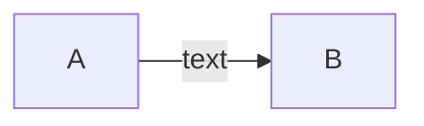

# Implementing Secure CI/CD Pipelines

## What is the objective?

- setting up a cloud lab environment
- building a pipeline
- implementing security checks into it

> this lab it ins't about taking the tools and integrating them into the pipeline. this is about knowing the metodology and the aprouch to implement a tool into a pipeline.

1. creating an appsec pipeline for a java application
2. integration with defectdojo and jira
3. integration of container security in CI/CD pipeline


[[_TOC_]]

---
## setting the cloud enviroment

### asd

#### asd

---
## the CI/CD pipeline



source version control -> commit  -> ci/cd 

check commit for sensitive info
build the container / product
host vulnerability assassment
source composition analysis
static app sec testing
dynamic app sec testing
container security testing

artifactory maven           vulnerability managment defect dojo
deploy
prod enviroment tomcat      reporting metrics 
 
### asd

#### asd

---
## asd

### asd

#### asd


> comment

```verde```

**negr**

<details>
<summary>asd</summary>

- asd
- asd
- asd

</details>
